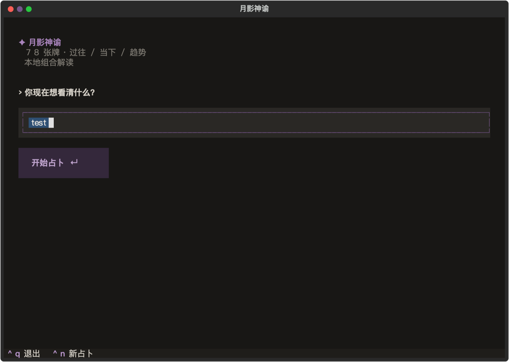
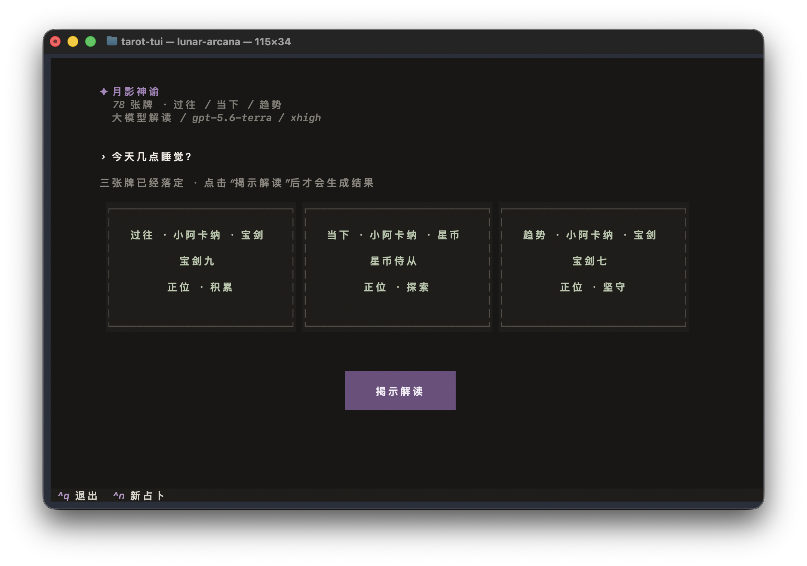
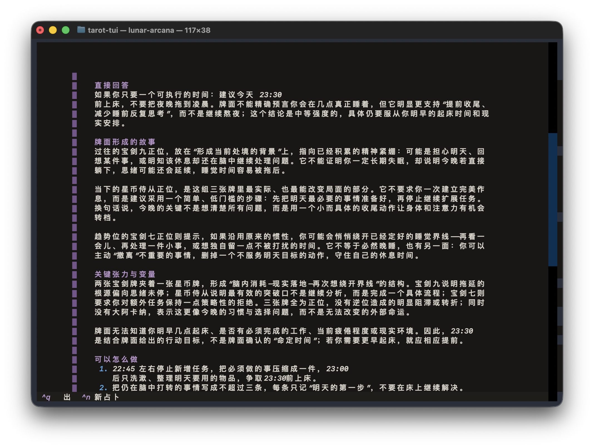
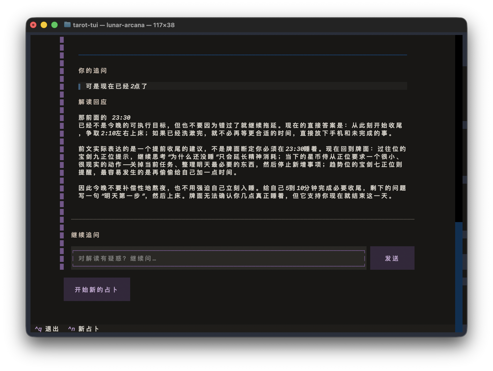

# 月影神谕 TUI

一个暗紫色界面的三牌阵终端塔罗工具。它使用完整 78 张牌和本地安全随机源抽牌，支持重复洗牌、点击翻牌，以及可选的大模型针对性解读和多轮追问。

## 界面预览

### 输入问题



### 揭示牌面



### 大模型解读



### 继续追问



预览来自当前 TUI 的实际运行界面，终端尺寸分别为 `115 x 34` 和 `117 x 38`。

## 运行

需要 Python 3.11 或更高版本。

```bash
git clone https://github.com/SShending/tarot-tui.git
cd tarot-tui
python3 -m venv .venv
source .venv/bin/activate
python -m pip install -e .
lunar-arcana
```

`lunar-arcana` 是安装后提供的启动命令；也可以使用 `python -m tarot_tui` 启动。

推荐使用至少 `80 x 32` 的终端窗口。较窄的终端会自动将三张牌改为纵向排列。

## 从 Release 安装

从 [GitHub Releases](https://github.com/SShending/tarot-tui/releases) 下载 `.whl` 文件，然后使用 `pipx` 安装：

```bash
pipx install ./lunar_arcana_tui-0.2.0-py3-none-any.whl
lunar-arcana
```

每个 `v*` 标签会自动生成跨平台 Wheel 和源码包，并上传到对应的 GitHub Release。

## 操作

- 输入问题后按 `Enter` 进入牌阵
- 点击“再洗一次”可以重复洗牌
- 点击第一张牌后锁定牌序，再依次点击后两张牌
- 三张牌全部揭示后，点击“揭示解读”生成结果
- 大模型解读完成后，可在结果下方继续追问；开始新的占卜会清空对话
- `Ctrl+N` 开始新的占卜
- `Ctrl+Q` 退出

## 针对性大模型解读

启动 `lunar-arcana` 后，程序会在终端依次完成以下配置：

- 输入服务的 Base URL；直接按回车会跳过大模型并进入本地解读页面
- 隐藏输入 API Key
- 从服务的 `/models` 接口读取模型，并通过编号选择；读取失败时可手动输入模型名称
- 选择 reasoning effort；不支持 reasoning 的兼容服务可选择“不发送 reasoning 参数”

OpenAI 官方 Base URL 是 `https://api.openai.com/v1`。读取模型列表需要 API Key 鉴权，因此 Key 必须在模型选择之前输入。`OPENAI_MODEL` 可以设置默认模型，但模型仍需存在于服务返回的列表中。

API Key 只在启动时输入，不会写入项目文件。模型调用使用 Responses API，且设置 `store=False`。多轮对话只保存在当前程序内存中，每次请求会重发本牌局的已有上下文；退出程序或开始新的占卜后即清空。兼容服务需要同时支持 `/models` 和 `/responses` 接口。

## 测试

激活项目虚拟环境后运行：

```bash
python -m unittest discover -s tests -v
```

测试覆盖牌组完整性、抽牌流程、窄终端响应式布局、大模型配置、上下文重放以及多轮追问。

## 当前范围

- 完整 78 张牌：22 张大阿卡纳与 56 张小阿卡纳
- 固定的“过往 / 当下 / 趋势”三牌阵
- 约三分之一的逆位概率
- 本地组合解读与可选的大模型针对性解读
- 大模型模式下可围绕当前固定牌面继续多轮追问
- 不保存问题或结果，不需要 API Key

本工具用于象征性反思，不提供医疗、法律、财务或危机判断，也不把牌面描述为确定未来。

## Roadmap

### v0.3 — Memory Agent

下一版本的目标是把一次性牌局扩展为一个本地优先、能够跨牌局记住用户旅程的 Tarot Agent：

- 持久化 Reading History（episodic memory）
- 为历史牌局补充 reflection / outcome
- 在新问题中检索少量相关历史，而不是重放全部记录
- 让大模型进行跨牌局比较，同时区分用户事实、历史解读与当前牌面
- 保持无后端、无向量数据库、无 Agent 框架的轻量实现

完整开发规格与验收标准见 [`docs/v0.3-memory-agent.md`](docs/v0.3-memory-agent.md)。

## 许可证

本项目采用 [MIT License](LICENSE) 开源。
